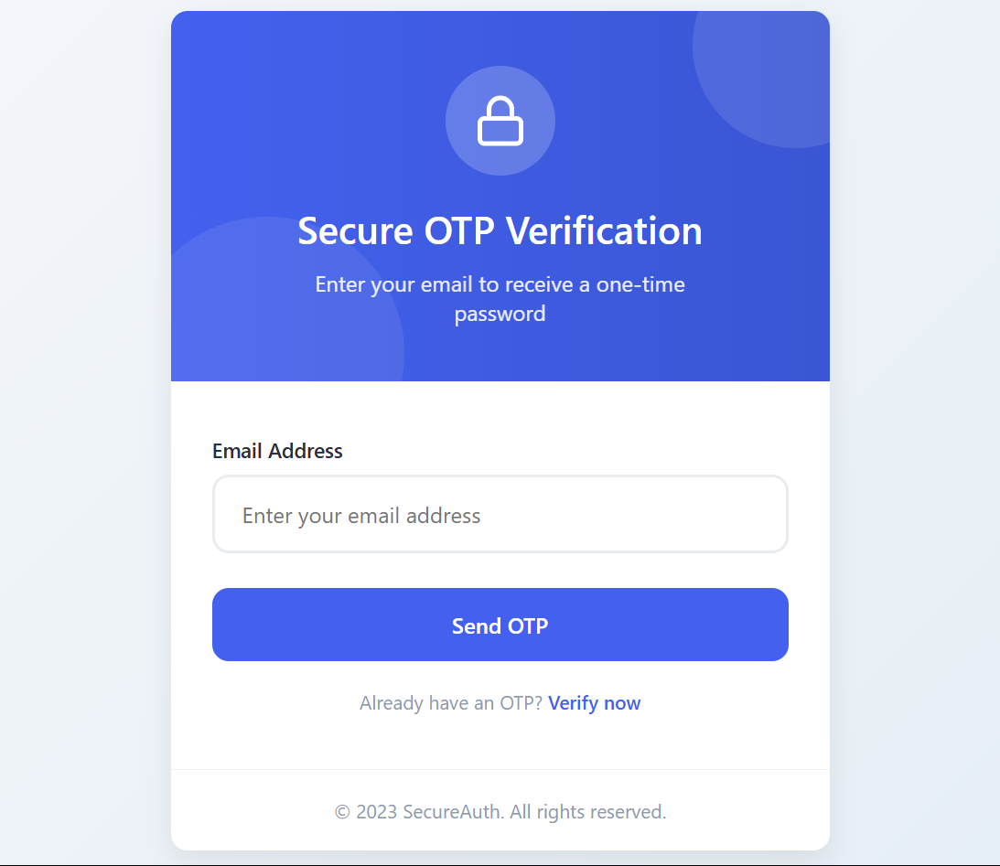

# 🔐 OTP Verification App

This is a full-stack OTP (One-Time Password) verification system built using **FastAPI** for the backend and **HTML/CSS/JavaScript** for the frontend. It allows users to enter their email, receive an OTP in their inbox, and verify the OTP to complete the authentication process.

---

## 🚀 Live Demo

👉 [Try the Live App](https://muzamilalisuleman.github.io/OTP-VERIFICATION-APP/)

---

## ⚙️ Tech Stack

- **Backend**: FastAPI (Python)
- **Frontend**: HTML, CSS, JavaScript
- **Email Delivery**: SMTP (via FastAPI)
- **Hosting**: GitHub Pages (frontend), FastAPI hosted separately

---

## ✨ Features

- ✅ OTP generation and validation
- ✅ Email-based OTP delivery using SMTP
- ✅ Responsive and interactive frontend
- ✅ FastAPI-powered REST endpoints
- ✅ Clean error/success handling for user feedback

---

THANK YOU !!!
